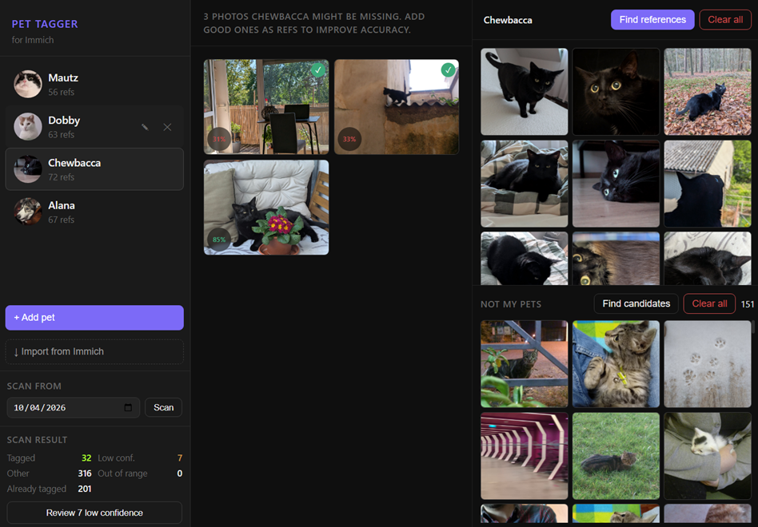

# immich-pet-tagger

Automatic pet tagging for Immich. Identifies your pets in new photos and tags them as people in Immich, the same way Immich tags human faces, but for cats, dogs, or any visually distinct subject.

Uses CLIP embeddings and a few reference photos you provide. No cloud services, no training required, runs entirely on your own hardware as a Docker sidecar alongside Immich.



## How it works

1. You enroll your pets via a web UI: provide a few reference photos and a short description
2. A logistic regression classifier is trained locally on CLIP embeddings of those references
3. Every 5 minutes, new photos are classified and matching pets are tagged in Immich
4. Pets appear in Immich's People section just like humans

## Features

- **Import from Immich**: if Immich already recognizes your pet as a person, import them in one click. The tool picks up to 20 evenly distributed reference photos automatically.
- **Find similar photos**: uses a two-stage search to surface candidates. Your reference photos are used as visual queries against Immich's smart search, and the local classifier re-ranks the results by pet probability. Falls back to text search using your description when no refs exist yet.
- **Find candidates for "not my pets"**: samples random photos from your library, scores them with the classifier, and surfaces the top 60 most likely to confuse it for bulk review.
- **Negative samples**: mark photos that look like your pet but aren't, to sharpen the classifier's ability to reject false positives.
- **Date ranges**: restrict a pet to photos taken within a specific period (useful for pets that have passed away or were adopted later).
- **Scan controls**: set the scan start date and trigger a scan from the sidebar; the last scan stats are shown live.

## Requirements

- Immich running via Docker Compose (tested with v2.7.5)
- Docker on the same host
- An Immich API key with the following permissions:

  | Permission | Reason |
  |---|---|
  | `asset.read` | Search results and asset metadata |
  | `asset.view` | Loading thumbnails |
  | `person.create` | Creating a new pet as a person in Immich |
  | `person.read` | Reading existing persons and thumbnails |
  | `person.update` | Renaming a pet |
  | `person.delete` | Deleting a pet |
  | `person.reassign` | Assigning a face to a person |
  | `face.create` | Writing face entries (the actual tagging) |
  | `face.read` | Checking existing faces on an asset |
  | `face.delete` | Removing face entries on ref removal or pet deletion |

## Setup

### 1. Clone the repository

```bash
git clone https://github.com/tedornitier/immich-pet-tagger
cd immich-pet-tagger
```

### 2. Find your Immich Docker network

```bash
docker network ls
```

Look for a network with "immich" in the name (e.g. `immich_default`).

### 3. Configure docker-compose.yml

Edit the following values:

```yaml
environment:
  - IMMICH_URL=http://immich-server:2283     # how this container reaches Immich (container-to-container)
  - IMMICH_API_KEY=your_api_key_here         # generate one in Immich: Account Settings → API Keys
  - IMMICH_EXTERNAL_URL=http://localhost:2283 # how your browser reaches Immich (for photo links)

networks:
  immich_default:          # match your actual network name from step 2
    external: true
```

### 4. Start the container

**NVIDIA GPU (default):** the pre-built image is pulled automatically from GHCR.

```bash
docker compose up -d
docker compose logs -f   # watch startup logs
```

**AMD (ROCm) or CPU-only:** build the image locally first (see [GPU support](#gpu-support)).

On first start, the YOLO model (~6 MB) and CLIP model (~350 MB) are downloaded and cached. Subsequent starts are fast.

### 5. Open the UI

Go to **http://localhost:8000** in your browser.

## Updating

To update to a new version, pull the latest image and restart:

```bash
docker compose pull
docker compose up -d
```

This works for all variants since pre-built images are published for NVIDIA, AMD, and CPU-only.

---

## Getting started

Getting good results takes a few iterations. Start by adding a pet, building up references, and adding some negatives. Run a short test scan, review the results, refine, and repeat until you're satisfied. Then run the full backfill.

### Step 1: Add your pet

**Import from Immich**: use this if Immich already recognizes your pet as a person from its own face detection.

1. Click **↓ Import from Immich** in the sidebar
2. Find and click your pet in the grid
3. Enter a short description (e.g. `orange tabby cat`) and an optional date range
4. Click **Import**. Up to 20 reference photos are imported automatically.

**Add manually**: use this if Immich doesn't know your pet yet.

1. Click **+ Add pet**, fill in the name, a short description (e.g. `black labrador dog`), and an optional date range
2. Click **Create**

The description is used by Immich's CLIP model to find the first batch of candidate photos. Keep it short: 2–4 descriptive keywords.

### Step 2: Add reference photos

References are what the classifier learns from. Quality matters more than quantity.

1. Select your pet in the sidebar and click **Find references**
2. Browse the results. They are ranked by visual similarity to your existing refs, or to your description if no refs exist yet.
3. Select clear, varied photos and click **Add to pet →**
4. Aim for 10–20 references to start; you can always add more

What to avoid:
- **Multiple animals in frame**: only one animal is cropped and classified per detection, so the photo might represent the wrong pet
- **Blurry or dark shots**: poor image quality produces unreliable embeddings
- **Uncertain ones**: if you're not sure it's your pet, skip it. A few noisy refs hurt more than having fewer refs overall.

### Step 3: Add "not my pets" samples

These help the classifier reject photos that look similar to your pet but aren't, reducing false positives.

1. In the **Not my pets** panel (bottom right of the screen), click **Find candidates**
2. The tool samples random photos from your library, scores them with the classifier, and surfaces the ones most likely to confuse it
3. Select photos that are not your pet and click **Not my pets**
4. Aim for roughly 2–3× as many negatives as total references across all pets

### Step 4: Run a test scan

Start with a recent date so the scan covers fewer photos, making it quicker to review and refine before committing to a full backfill.

1. In the **Scan from** panel at the bottom of the sidebar, set a date 1–2 weeks back
2. Click **Scan** and wait for the results
3. If **Review N low confidence** appears in the results, click it to see photos the classifier identified as a match but wasn't fully confident about.
4. Go through them: add correctly identified ones as references, mark wrong ones as **Not my pets**, and skip the rest

### Step 5: Iterate

Repeat steps 2–4 a couple of times. Each round of added references and negatives improves accuracy. Results typically stabilize after 2–3 iterations.

### Step 6: Run the full backfill

Once you're happy with the accuracy on the test window:

1. Set the scan date to the earliest date you want to tag. A good starting point is the date you got your pet.
2. Click **Scan** to process all photos in that range

After that, the background poller runs every 5 minutes and tags new photos automatically. Your pets appear in Immich's **People** section.

---

## Environment variables

| Variable | Default | Description |
|---|---|---|
| `IMMICH_URL` | `http://immich-server:2283` | Immich URL for container-to-container communication |
| `IMMICH_EXTERNAL_URL` | `http://localhost:2283` | Immich URL as seen from your browser, used for links |
| `IMMICH_API_KEY` | required | Immich API key |
| `POLL_INTERVAL` | `300` | Seconds between scans |
| `SCAN_WORKERS` | `GPU_WORKERS × 32` | Concurrent thumbnail fetches. Auto-derived to keep GPU batches full. Override only if Immich feels slow during scans. |
| `GPU_WORKERS` | `2` | Parallel YOLO and CLIP inference threads. `2` is optimal for most GPUs; more threads shrink batch sizes and hurt throughput. |
| `THRESHOLD` | `0.8` | Min confidence (0–1) to tag a photo |

---

## GPU support

A GPU makes scans significantly faster but is not required. Pre-built images are published for all three variants.

**NVIDIA (default):** no changes needed, uses the `latest` image.

**AMD GPU:** in `docker-compose.yml`, change the image tag and the deploy driver:
```yaml
image: ghcr.io/tedornitier/immich-pet-tagger:rocm
# under build.args:
  ROCM: "true"
# under deploy.resources.reservations.devices:
  driver: amdgpu
```

**No GPU (CPU-only):** in `docker-compose.yml`, change the image tag and remove the deploy section:
```yaml
image: ghcr.io/tedornitier/immich-pet-tagger:cpu
# remove the entire deploy: section
```

CPU-only works fine for small libraries or infrequent scans. Expect roughly 10x slower processing.

## Limitations

- **YOLO fallback**: when no animals are detected by YOLO, the full image is classified as a whole and only one pet can be tagged per photo
- **Polling only**: photos are processed within 5 minutes of upload, not instantly

## Troubleshooting

**Pet not appearing in Immich after enrollment**
Immich only shows people with at least one face assigned. Add at least one reference photo and wait for a poll cycle.

**Low accuracy / wrong pet tagged**
Add more reference photos, add more negative samples, or lower the threshold in `docker-compose.yml`.

**Container can't reach Immich**
Make sure the network name in `docker-compose.yml` matches the output of `docker network ls`.

**Thumbnail proxy returns 401**
Your API key is missing `asset.view` permission.
